# Secure Api Lab

## Лабораторно-практична робота №3
**Тема:** Розробка та тестування захищеного REST API на Node.js та Express  

Lab3 (Secure Api Lab)  
Конструювання Програмного Забезпечення (КПЗ)  

Студентка: Матвєєнко Олександра  
Група: ІПЗ-3.03  

## Опис проєкту
Цей проєкт — лабораторна робота з розробки та тестування захищеного REST API на Node.js і Express, де реалізовані реєстрація/вхід користувачів, рольова авторизація, ендпоїнти, валідація запитів та логування помилок  
**Мета:** реалізувати захищений REST API з прикладами та механізмами захисту  
> Усі дані зберігаються у файлі data.js, а тестування виконується через Postman та програмний скрипт test-client.js

## Project start-up
**Встановити залежності:**  
```bash
npm install
```
**Запустити локальний сервер:**  
```bash
npm start
```
> Доступний за посиланням: http://localhost:3000  

**Запустити тести:**  
```bash
npm test
```
> Виконувати тільки після запуску сервера  

## Структура проєкту  
```
📁 KPZ_Lab3_Matvieienko-secure-api-lab/
├── 📁 docs/
|   ├──📁 postman-tests/   ← папка зі скріншотами тестів у Postman
|   ├──📁 screenshots/
├── 📁 node_modules/       ← тільки локально
├── 📄 .gitignore          ← файл для ігнорування непотрібних файлів
├── 📄 data.js
├── 📄 package-lock.json
├── 📄 package.json
├── 📄 README.md
├── 📄 server.js
└── 📄 test-client.js
```

## Middleware — логування, аутентифікація та авторизація
Ця таблиця демонструє ключові відмінності в роботі API до та після впровадження `middleware` для аутентифікації та авторизації. Спочатку сервер був повністю відкритим, а тепер він захищений, валідує користувачів і реагує на різні запити, логуючи їх  
| До впровадження Middleware | Після впровадження Middleware |
| :--- | :--- |
| 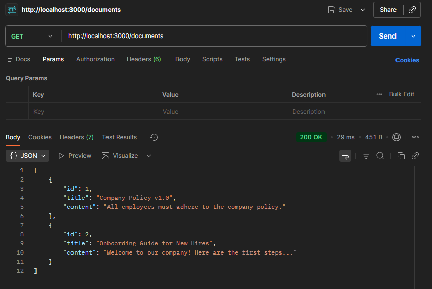 | 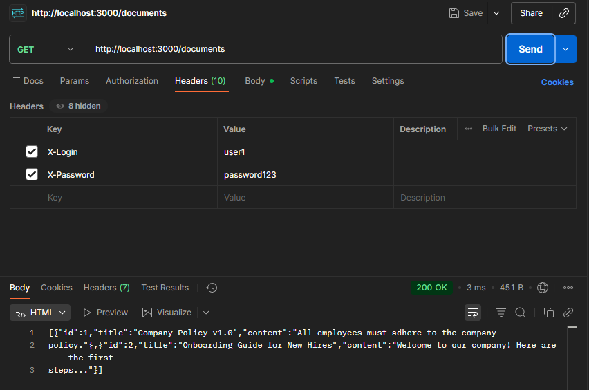 |
| 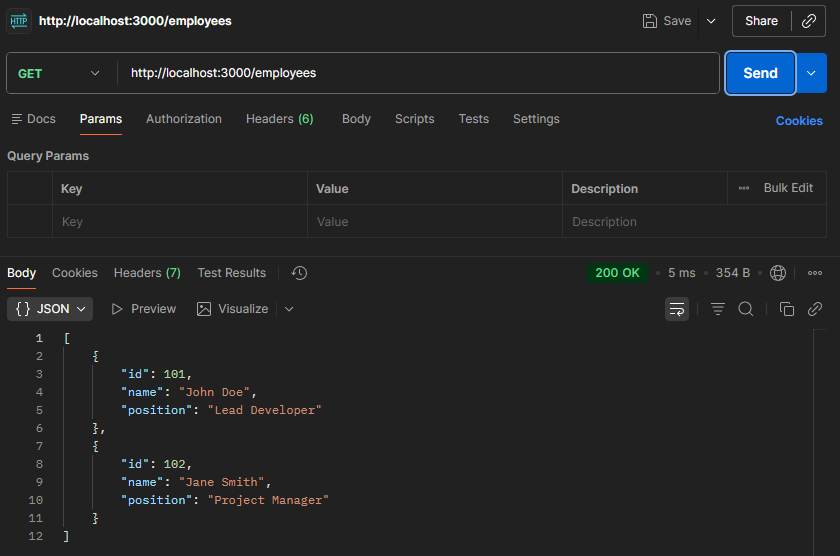 | 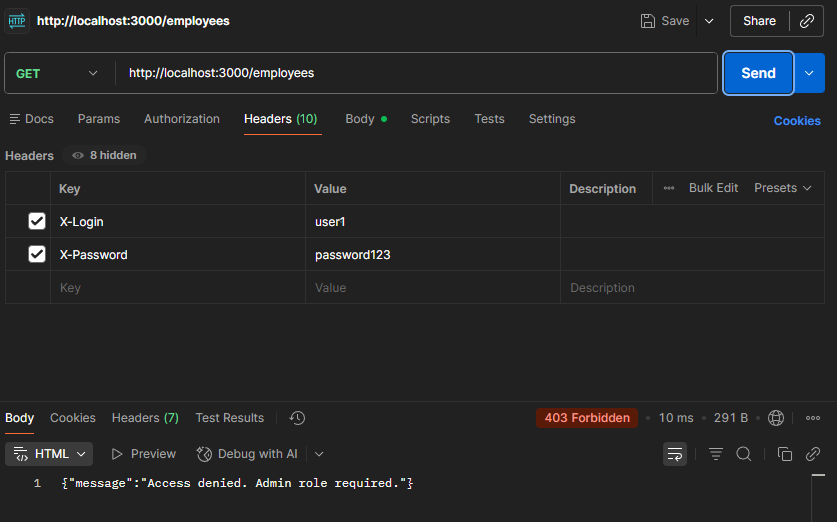 |
| 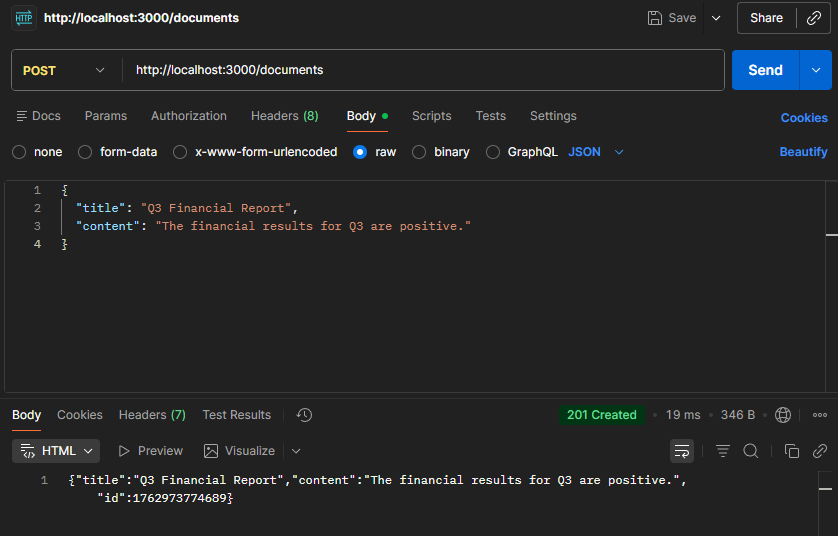 | 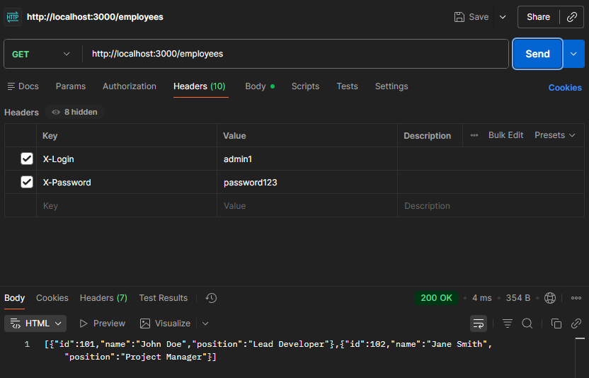 |

## Реалізовані ендпоінти

| HTTP Метод | URL | Опис | Необхідні заголовки | Тіло запиту (JSON) | Можливі коди відповіді |
|-------------|-----|------|----------------------|----------------------|---------------------------|
| **GET** | `/documents` | Отримати всі документи | `X-Login`, `X-Password` | — | 200 OK, 401 Unauthorized |
| **POST** | `/documents` | Додати новий документ | `X-Login`, `X-Password` | `{ "title": "Text", "content": "Text" }` | 201 Created, 400 Bad Request, 401 Unauthorized |
| **DELETE** | `/documents/:id` | Видалити документ за ID | `X-Login`, `X-Password` | — | 204 No Content, 401 Unauthorized, 404 Not Found |
| **GET** | `/employees` | Отримати список співробітників | `X-Login`, `X-Password` (роль `admin`) | — | 200 OK, 401 Unauthorized, 403 Forbidden |

> Приклад для запита списку співробітників (тільки адмін)  
> 

## HTTP-коди, що підтримуються сервером

| Код | Значення | Коли використовується |
|------|-----------|-----------------------|
| **200 OK** | Запит виконано успішно | GET /documents, GET /employees |
| **201 Created** | Створено новий ресурс | POST /documents |
| **204 No Content** | Видалення виконано | DELETE /documents/id |
| **400 Bad Request** | Невірні дані у запиті | Відсутній title або content |
| **401 Unauthorized** | Неавторизований користувач | Немає або некоректні X-Login / X-Password |
| **403 Forbidden** | Немає прав доступу | Користувач без ролі admin звертається до /employees |
| **404 Not Found** | Ресурс не знайдено | Видалення неіснуючого документа |

## Демонстрація роботи через Postman

| Метод | URL | Заголовки (Headers) | Тіло (Body) | Очікуваний статус | Примітка | Скріншот |
| :--- | :--- | :--- | :--- | :--- | :--- | :--- |
| `GET` | ` /documents ` | - | - | `401 Unauthorized` | Спроба доступу без аутентифікації. | 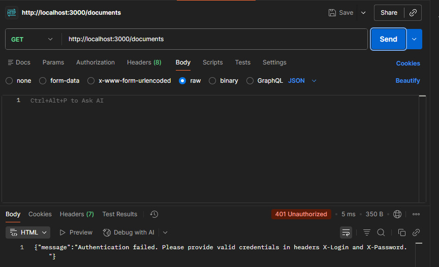 |
| `GET` | ` /employees ` | `X-Login: user1`<br>`X-Password: password123` | - | `403 Forbidden` | Спроба доступу до адмін-ресурсу з роллю 'user'. |  |
| `GET` | ` /documents ` | `X-Login: user1`<br>`X-Password: password123` | - | `200 OK` | Успішне отримання даних з роллю 'user'. | 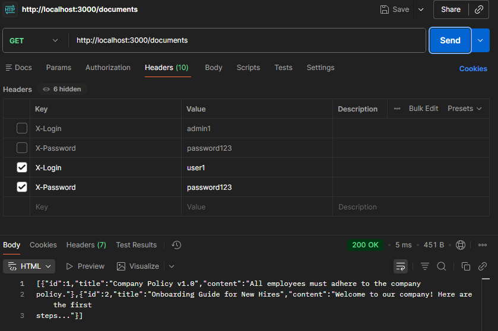 |
| `GET` | ` /employees ` | `X-Login: admin1`<br>`X-Password: password123` | - | `200 OK` | Успішне отримання даних з роллю 'admin'. | 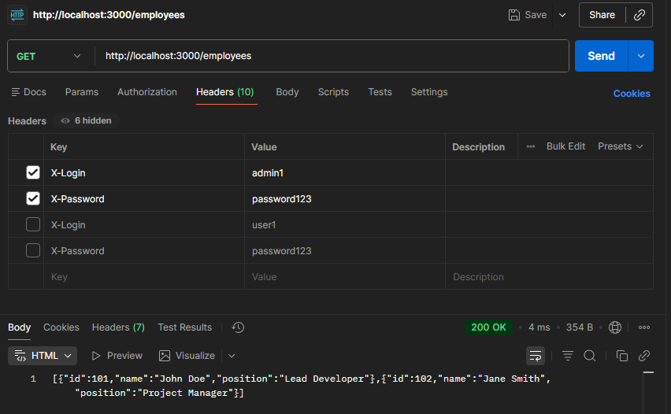 |
| `POST` | ` /documents ` | `X-Login: user1`<br>`X-Password: password123` | ` { "title": "Test Doc", "content": "..." } ` | `201 Created` | Успішне створення ресурсу. | 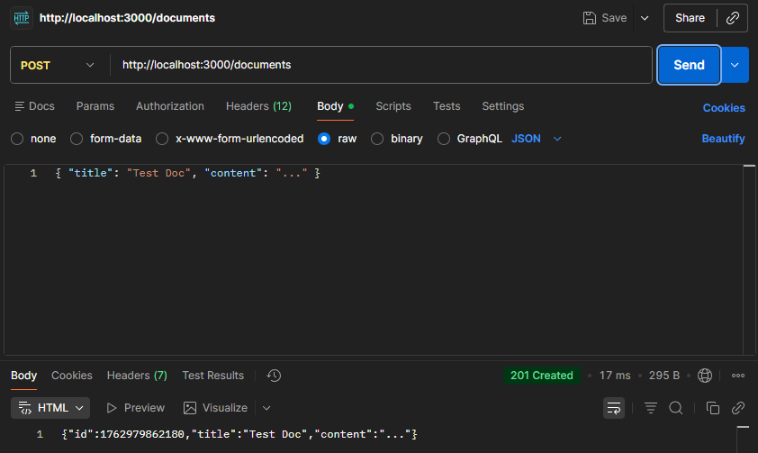 |
| `POST` | ` /documents ` | `X-Login: user1`<br>`X-Password: password123` | ` { "content": "..." } ` | `400 Bad Request` | Помилка валідації (відсутнє поле `title`). | 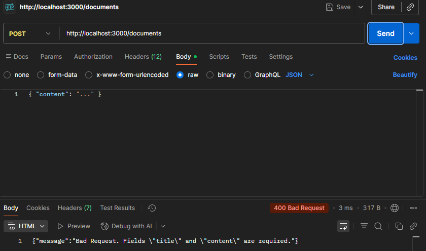 |
| `DELETE` | ` /documents/1 ` | `X-Login: admin1`<br>`X-Password: password123` | - | `204 No Content` | Успішне видалення. Відповідь не має тіла. | 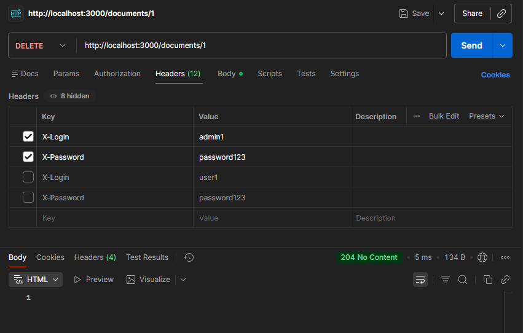 |
| `GET` | ` /non-existent ` | `X-Login: admin1`<br>`X-Password: password123` | - | `404 Not Found` | Звернення до неіснуючого маршруту. | 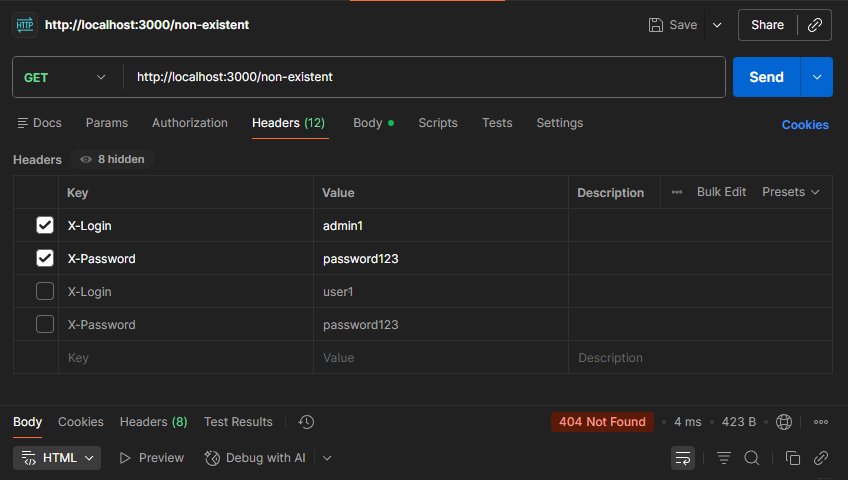 |

## Тестовий клієнт `test-client.js`

Файл демонструє автоматичні звернення до API для перевірки базових сценаріїв:

- Отримання списку документів як звичайний користувач (200 OK)  
- Спроба отримати список співробітників як користувач (403 Forbidden)  
- Успішне отримання списку співробітників як адміністратор (200 OK)  

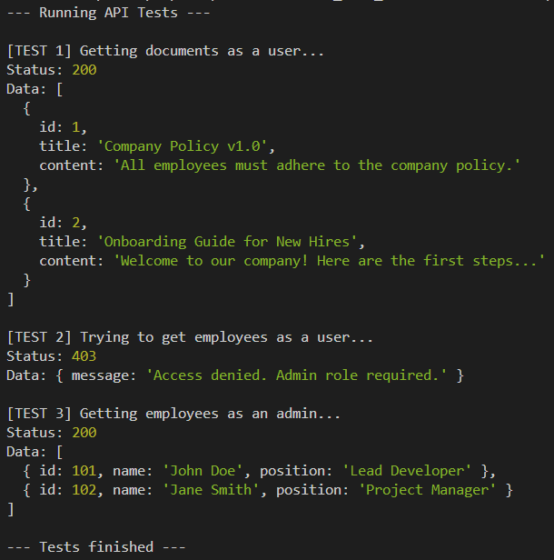  

## Посилання
🥀 [Репозиторій GitHub](https://github.com/Allaandra/KPZ_Lab3_Matvieienko-secure-api-lab)  
🥀 [Історія комітів](https://github.com/Allaandra/KPZ_Lab3_Matvieienko-secure-api-lab/commits/main/)  
🥀 [Скріншоти тестів у Postman](https://github.com/Allaandra/KPZ_Lab3_Matvieienko-secure-api-lab/tree/main/docs/postman-tests)  
🥀 [Інші скріншоти](https://github.com/Allaandra/KPZ_Lab3_Matvieienko-secure-api-lab/tree/main/docs/screenshots)